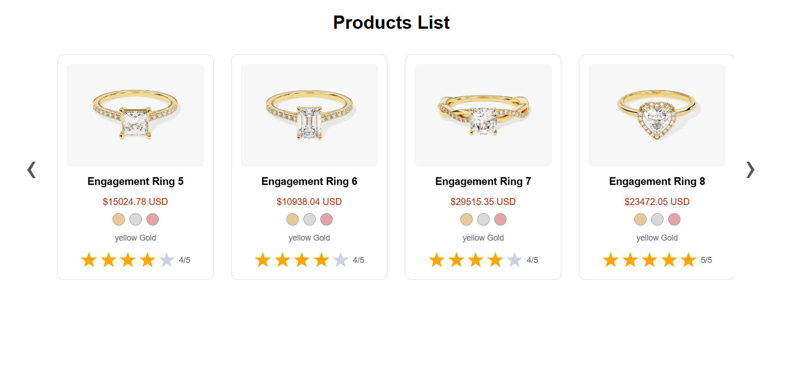

# Renart Case Study

Renart Case Study is a fullstack demonstration project that showcases a simple gold product listing and filtering application. It integrates live gold prices using [GoldAPI](https://www.goldapi.io/) and allows users to view and filter products by price. This project was created as a case study to explore and showcase fullstack development skills.



---

## Features

- **Live gold price integration** via GoldAPI
- **Product listing** with price filtering (min/max)
- **Modern React frontend** using Vite
- **Material UI icons** and star ratings
- **Express.js backend** with REST API
- **CORS-enabled** for frontend-backend communication
- **Environment variable support** for API keys
- **Deployed on Render and Netlify** (see [backend demo filter](https://rena-fullstack.onrender.com/filter?minPrice=18000))

---

## Tech Stack

- **Frontend:** React, Vite, Material UI, react-star-ratings
- **Backend:** Express.js, Node.js, axios, cors, dotenv
- **API:** [GoldAPI](https://www.goldapi.io/)
- **Other:** MIT License

---

## Project Structure

```
/rena
  /backend      # Express.js server
    server.js   # Main entry point (run this)
  /frontend     # React app (Vite)
    ...         # All frontend code
```

---

## Getting Started

### Local Development

#### Frontend

```bash
git clone https://github.com/muhegebi20/rena.git
cd rena/frontend
npm install
npm run dev
```
Runs the React frontend on [http://localhost:5173](http://localhost:5173).

#### Backend

```bash
cd rena/backend
npm install
# For development (with auto-reload)
npx nodemon server.js
# For production
node server.js
```
Runs the Express backend on [http://localhost:5000](http://localhost:5000) or the PORT you set.

---

## Environment Variables

Create a `.env` file in `/backend`:

```
API_KEY=your_goldapi_key_here
```
You can get a free API key from [GoldAPI](https://www.goldapi.io/).

---

## API Endpoints

- **/**  
  Returns all products.

- **/filter?minPrice=18000&maxPrice=20000**  
  Returns products filtered by min and/or max price.  
  _Example:_ [`/filter?minPrice=18000`](https://rena-fullstack.onrender.com/filter?minPrice=18000)

> _Note:_ Filtering currently works at the backend level; the frontend is not yet connected to the `/filter` endpoint.

---

## Deployment

This project is deployed to:

- **Frontend:** [https://legendary-khapse-d7aac3.netlify.app/](https://legendary-khapse-d7aac3.netlify.app/)
- **Backend:** [https://rena-fullstack.onrender.com](https://rena-fullstack.onrender.com)

---

## License

MIT

---

## Credits

- [GoldAPI](https://www.goldapi.io/) for gold price data
- [Material UI](https://mui.com/) for icons
- [React Star Ratings](https://www.npmjs.com/package/react-star-ratings)
